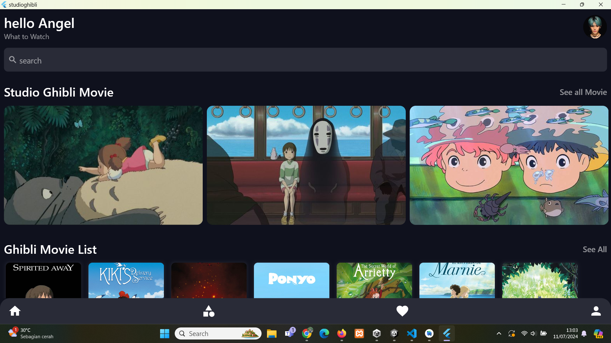
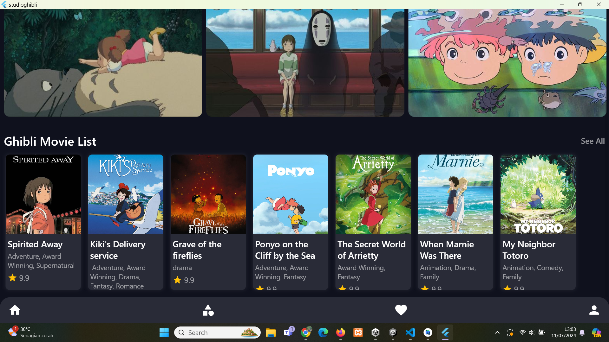

# 🎬 Flutter GhibliMovie

Aplikasi Flutter untuk menampilkan daftar film dari Studio Ghibli dengan antarmuka yang ramah pengguna.

## Halaman awal

## List Film 

## Detail Movie


## Deskripsi Proyek

Flutter GhibliMovie adalah aplikasi sederhana yang menggunakan API Studio Ghibli untuk menampilkan daftar film beserta detailnya. Aplikasi ini dibangun dengan Flutter untuk menciptakan pengalaman pengguna yang responsif dan menarik.

## Fitur Utama

- 🎥 **Daftar Film**: Menampilkan semua film Studio Ghibli.
- 📝 **Detail Film**: Informasi lengkap tentang setiap film seperti judul, deskripsi, direktur, produser, tanggal rilis, dan skor RT.
- 🔍 **Pencarian Film**: Fitur pencarian untuk mencari film berdasarkan judul.
- 📱 **Antarmuka Responsif**: Desain yang responsif untuk pengalaman pengguna yang optimal di berbagai perangkat.


## Instalasi

### Prasyarat
Pastikan Flutter telah terinstal di komputer Anda. Jika belum, Anda dapat mengunduhnya dari [sini](https://flutter.dev/docs/get-started/install).

### Langkah-langkah Instalasi

1. **Clone repositori:**
   ```bash
   git clone https://github.com/angelinanaa/flutter-GhibliMovie.git
   cd flutter-GhibliMovie
   ```

2. **Install dependencies:**
   ```bash
   flutter pub get
   ```

3. **Jalankan aplikasi:**
   ```bash
   flutter run
   ```

## Struktur Proyek

```
flutter-GhibliMovie/
├── android/
├── build/
├── ios/
├── lib/
│   ├── main.dart
│   ├── models/
│   │   └── film.dart
│   ├── screens/
│   │   ├── film_detail_screen.dart
│   │   └── film_list_screen.dart
│   ├── services/
│   │   └── api_service.dart
│   └── widgets/
│       └── film_card.dart
├── test/
├── .gitignore
├── pubspec.yaml
└── README.md
```
